<p align="center">
  
</p>

<p align = "center">
  
  
  
  
  
  
  
</p>

# :mag: Mr.Holmes 

**Mr.Holmes is a information gathering tool (OSINT). The main purpose is to gain information about domains,username and phone numbers with the help of public source avaiable on the internet also it use the google dorks attack for specific researchers. It also use proxies for make your requests completley anonymous and a WhoIS Api for getting more information about a domain.**
<br>

# :heavy_exclamation_mark: DISCLAIMER
**This Tool is Not 100% Accurate so it can fail somtimes. Also this tool is made for educational and research purposes only, i do not assume any kind of responsibility for any imprope use of this tool.**
<br>

#  SCREENSHOT


<br>

<p align = "center">
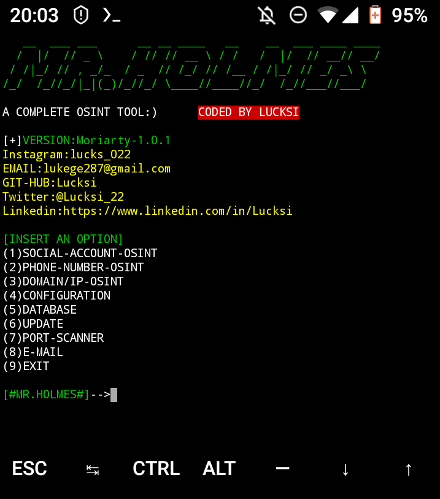
</p>

<br>

# :heavy_check_mark: INSTALLATION LINUX/MAC:
```bash
git clone https://github.com/Lucksi/Mr.Holmes
cd Mr.Holmes
sudo apt-get update
sudo chmod +x install.sh
sudo bash install.sh
```
<br>

# :heavy_check_mark: INSTALLATION LINUX/MAC (Venv Enviroment):
**if you encounter some errors in the python libraries installation use this method**
```bash
git clone https://github.com/Lucksi/Mr.Holmes
sudo apt-get update
cd Mr.Holmes
python3 -m venv .lib_venv
sudo chmod +x install.sh
sudo bash install.sh
source .lib_venv/bin/activate
pip3 install -r requirements.txt
python3 MrHolmes.py
```
<br>

# :heavy_check_mark: INSTALLATION WINDOWS (1°WAY)
**If you have git installed on your windows machine you can do the following commands:**
```cmd
git clone https://github.com/Lucksi/Mr.Holmes
cd Mr.Holmes
Install.cmd
```
<br>

# :heavy_check_mark: INSTALLATION WINDOWS (2° WAY):
**If you download the zip file of Mr.Holmes you should first unzip it and after that do the following commands:**
```cmd
ren Mr.Holmes-master Mr.Holmes
cd Mr.Holmes
Install.cmd
```
<br>

# :heavy_check_mark: INSTALLATION TERMUX:
```bash
pkg install proot
git clone https://github.com/Lucksi/Mr.Holmes
cd Mr.Holmes
proot -0 chmod +x install_Termux.sh
./install_Termux.sh
```
<br>

#  USAGE LINUX/MAC:
    cd Mr.Holmes
    sudo python3 MrHolmes.py
    OR:
    cd Mr.Holmes
    cd Launchers
    Execute Launcher.sh

<br>
    
#  USAGE LINUX/MAC(Venv Enviroment):
    cd Mr.Holmes
    source .lib_venv/bin/activate
    python3 MrHolmes.py

<br>

#  USAGE TERMUX/WINDOWS:
    python3 MrHolmes.py
<br>

#  USAGE WINDOWS:
    python MrHolmes.py
    OR
    cd Launchers
    Execute Win_Launcher.exe

<br>

# API KEY LINK:
    https://whois.whoisxmlapi.com
<br>

# SETTINGS FOLDER:

    Configuration/Configuration.ini
<br>

# :heavy_exclamation_mark: ATTENTION
**DATABASE NOT AVAIABLE ON TERMUX**
<br>

# :heavy_exclamation_mark: ATTENTION ON WINDOWS
**IF PYTHON AND PHP WONT INSTALL YOU HAVE TO DOWNLOAD THEM MANUALLY:**
    
<br>

# VERSIONS LIST:
    https://lucksi.github.io/Mr.Holmes/Pages/versions.html
<br>

# :heavy_check_mark: GUI DARK/LIGHT MODE:
```bash
cd GUI
cd Theme
edit Mode.json
write:Light=(Light-Mode)
write:Dark=(Dark-Mode) 
write:High-Contrast(High-Contrast-Mode)
```
<br>

# :heavy_check_mark: Mode.json CODE EXAMPLE:
```json
{
    "Color": {
        "Background": "Light"
    }
}
```
<br>

# :heavy_check_mark: GUI/USERNAME/PASSWORD:
```bash
cd GUI
cd Credentials
edit Login.json
write:Status=Active/Deactive
edit Users.json
write:Username=Your Username
write:Password=Your Password
```
<br>

# :heavy_check_mark: Login.json CODE EXAMPLE:
```json    
{
    "Database": {
        "Status": "Active"
    }
}
```
<br>

# :heavy_check_mark: Users.json CODE EXAMPLE
```json
{
    "Users":[
        {
            "Username": "Your Username",
            "Password": "Your Password"
        }
    ]
}
```
<br>

# :heavy_check_mark: LANGUAGE SETTINGS:
```bash
cd GUI
cd Language
edit Language.json
```
<br>

# :heavy_check_mark: Language.json CODE EXAMPLE:
```json
{
    "Language": {
        "Preference": "English"
    }
}
```
<br>

# DEFAULT USERNAME AND PASSWORD:
    Username:Admin
    Password:Qwerty123

<br>

# AVAIABLE LANGUAGES:
    Italiano 🇮🇹 
    English 🏴󠁧󠁢󠁥󠁮󠁧󠁿
    Français 🇫🇷

<br>

# ACTUAL VERSION:
## T.G.D-1.0.4

<br>

# INTERACTIVE MAP HAS BEEN MADE WITH:
**Leaflet: https://leafletjs.com**

<br>

# USERNAME ENTITIES:
**The Icons on Folder: /GUI/Icon/Entities/Site_Icon have been taken from: https://www.iconfinder.com/ all credit goes to their respective creators**

<br>

# ENCODING:
**With this version it is Possible to Encode your reports**

<br>

# DECODING:
**With this version it is Possible to Decode your reports**

<br>

# HYPOTHESIS
**This new version Permits to generate some "Hypothesis" on the subject in base of their numbers on varios social media including possible hobbies/interests (It may not be a 100% attendible)**

<br>

# EMAIL-LOOKUP:
**With this new version is possible to check if an email is connected to some specific socials/services without letting the target know it.**

<br>

# GRAPHS:
**With this new version has been added the possibility to create Graphs in order to create a schema for information scheduling.**

<br>

# EXAMPLE:

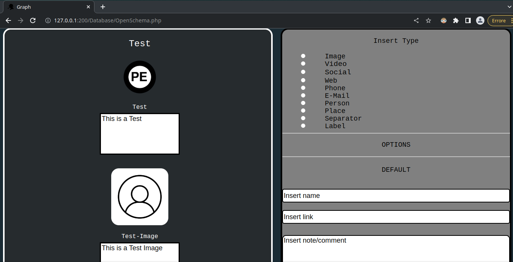

<br>

# MAPS:
**With this new version has been added the possibility to create Interactive Maps.**

<br>

# EXAMPLE:

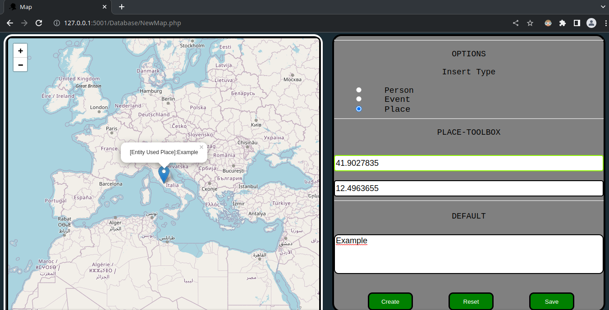

<br>

# DORKS:
**With this new version it is possible to search Video/Sound/Images via Dorks (1) and to effectuate specific research adding date ex '1998/01/1' or date range ex '1998/01/01-2020/12/31' (2).**

<br>

# EXAMPLE (1):


<br>

# EXAMPLE (2):

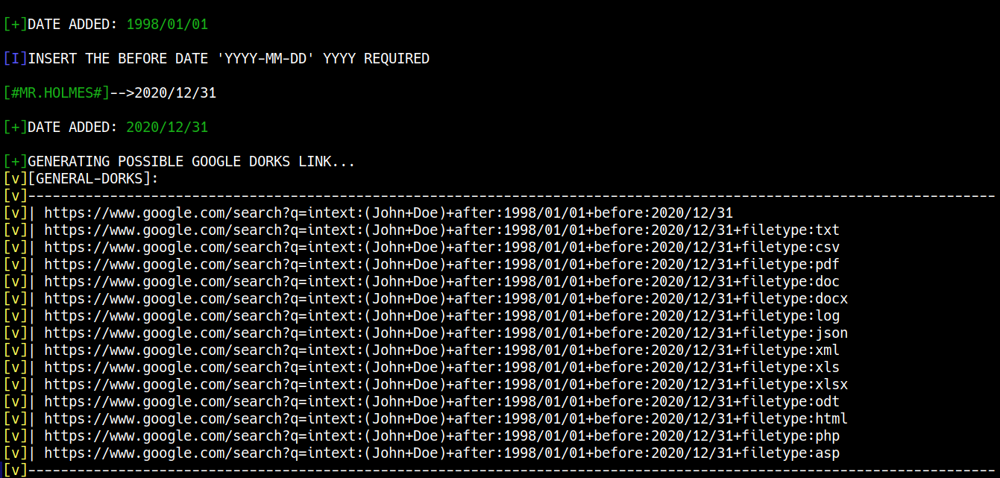

<br>

# PDF:
**With this new version has been added the possibility to converte your Graphs in PDF.**

<br>

# EXAMPLE:
<p align = "center">
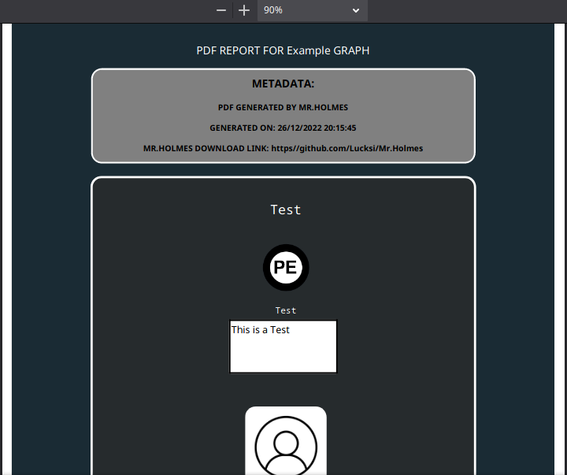
</p>

<br>

# AVAILBLE PDF-THEMES:
    Light 🌕
    Dark 🌗
    High-Contrast 🌗

<br>

# FILE-TRANSFER:
**With this version it is Possible to Transfer your reports directly to Your Phone Via Qr-Code**

<br>

# FILE-TRANSFER PAGE:
<p align = "center">
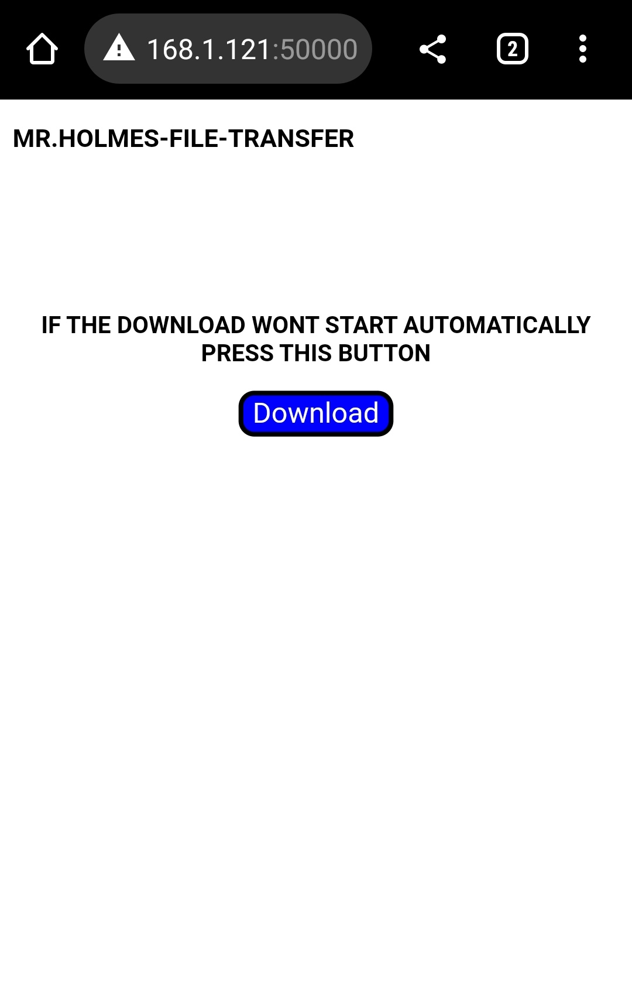
</p>

<br>

# :last_quarter_moon: DARK MODE:
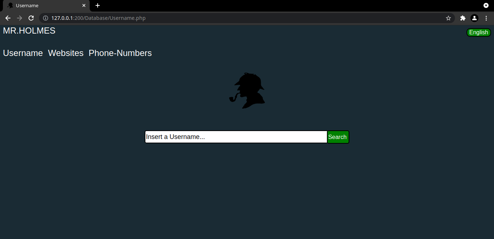

<br>

<p align = "center">
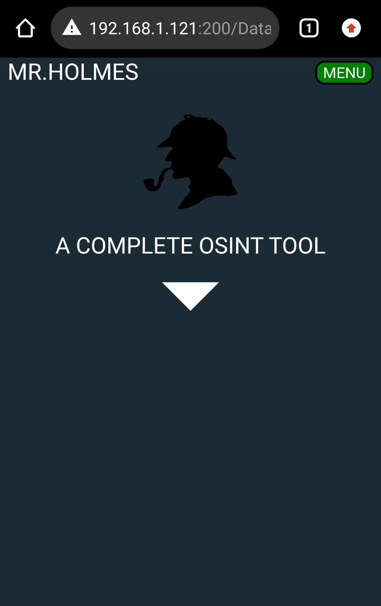
</p>

<br>

# :full_moon: LIGHT MODE:
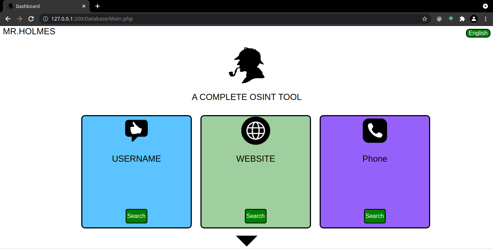

<br>

<p align = "center">
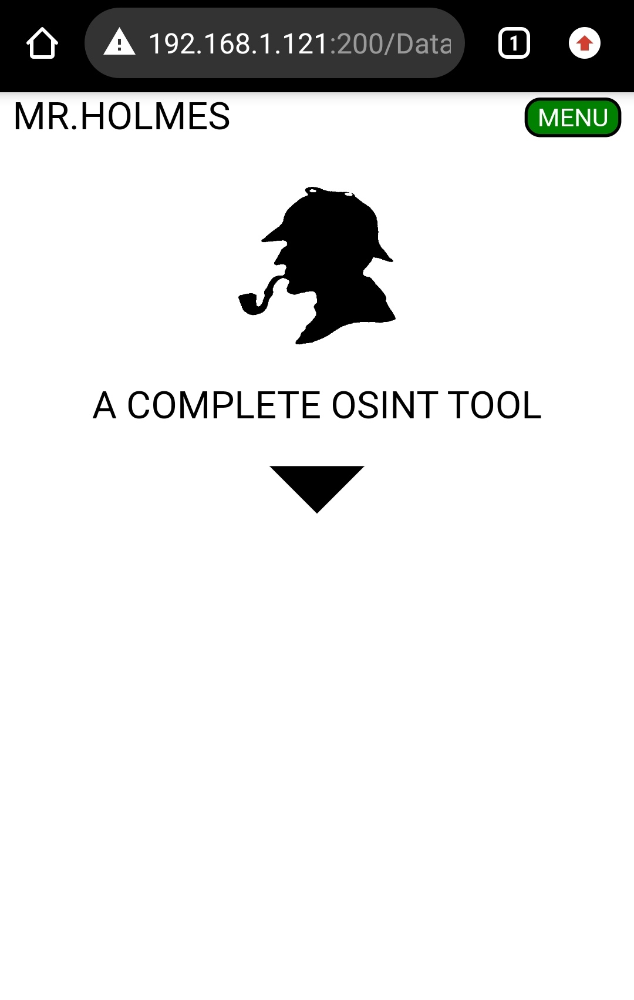
</p>


<br>

# :last_quarter_moon: HIGH-CONTRAST MODE:


<br>

<p align = "center">
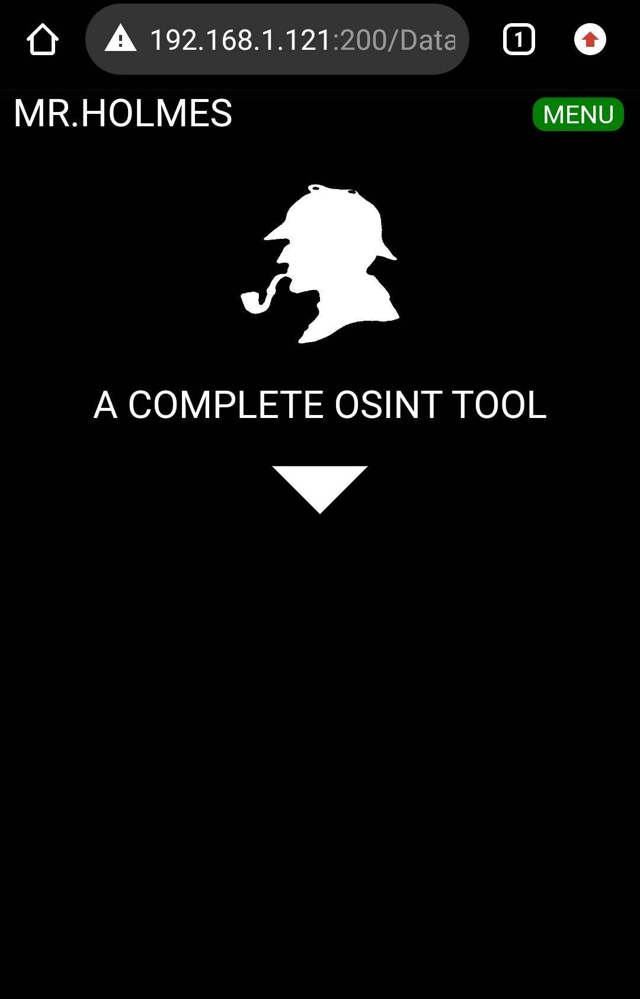
</p>

<hr>
<br>


## <p align = center> STARGAZERS OVER TIME 


[](https://starchart.cc/Lucksi/Mr.Holmes)

<br>

## <p align= center>MADE WITH :heart: BY LUCKSI IN :it:</p>

## <p align = center>  ORIGINAL CREATOR: <a href = "https://github.com/Lucksi">LUCA GAROFALO (Lucksi)</a></p>


## <p align = center>LICENSE: GPL-3.0 License <br>COPYRIGHT: (C) 2021-2025 Lucksi
