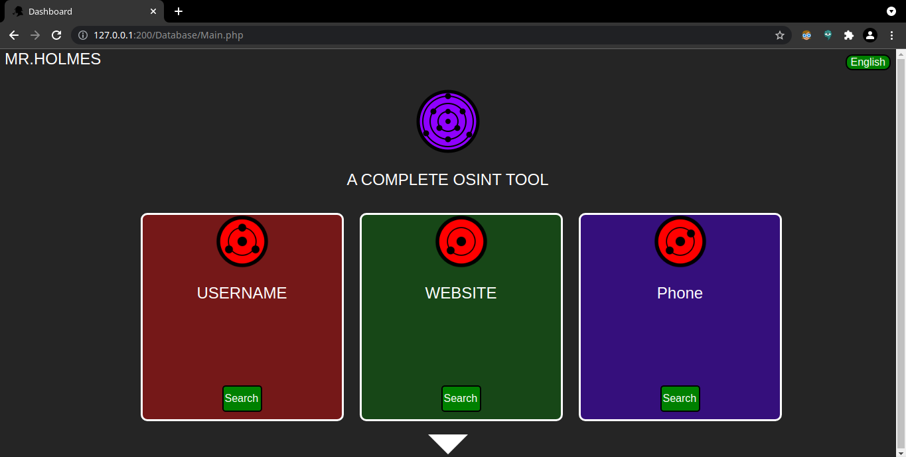
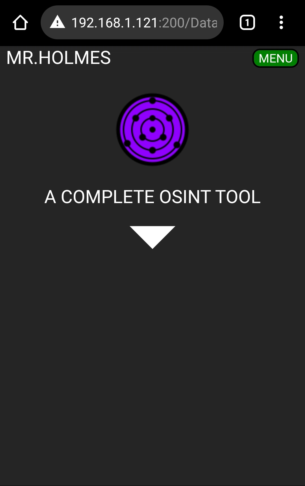

<p align="center">
  
</p>

<p align = "center">
  
  
  
  
  
  
</p>

# :mag: Mr.Holmes 

### Mr.Holmes is a information gathering tool (OSINT). The main purpose is to gain information about domains,username and phone numbers with the help of public source avaiable on the internet also it use the google dorks attack for specific researchers. It also use proxies for make your requests completley anonymous and a WhoIS Api for getting more information about a domain.
<br>

# :heavy_exclamation_mark: DISCLAIMER
### This Tool is Not 100% Precise so it can fail somtimes. Also this tool is made for educational and research purposes only..use it wisely
<br>

#  SCREENSHOT


<br>

# :heavy_check_mark: INSTALLATION LINUX/MAC:
```bash
git clone https://github.com/Lucksi/Mr.Holmes
cd Mr.Holmes
sudo chmod +x install.sh
sudo ./install.sh
```
<br>

# :heavy_check_mark: INSTALLATION WINDOWS:
```bash
git clone https://github.com/Lucksi/Mr.Holmes
cd Mr.Holmes
Install.cmd
```
<br>

# :heavy_check_mark: INSTALLATION TERMUX:
```bash
pkg install proot
git clone https://github.com/Lucksi/Mr.Holmes
cd Mr.Holmes
proot -0 chmod +x install_Termux.sh
./install_Termux.sh
```
<br>

#  USAGE LINUX/MAC:
    sudo python3 MrHolmes.py
    OR:
    cd Launchers
    Execute Launcher.sh

<br>

#  USAGE TERMUX/WINDOWS:
    python3 MrHolmes.py
<br>

#  USAGE WINDOWS:
    python MrHolmes.py
    OR
    cd Launchers
    Execute Win_Launcher.exe

<br>

# API KEY LINK:
    https://whois.whoisxmlapi.com
<br>

# SETTINGS FOLDER:

    Configuration/Configuration.ini
<br>

# :heavy_exclamation_mark: ATTENTION
### DATABASE NOT AVAIABLE ON TERMUX
<br>

# :heavy_exclamation_mark: ATTENTION ON WINDOWS
### IF PYTHON AND PHP WONT INSTALL YOU HAVE TO DOWNLOAD THEM MANUALLY:
    
<br>

# VERSIONS LIST:
    https://lucksi.github.io/Mr.Holmes/Pages/versions.html
<br>

# :heavy_check_mark: GUI DARK/LIGHT MODE:
```bash
cd GUI
cd Theme
edit Mode.json
write:Light=(Light-Mode)
write:Dark=(Dark-Mode) 
write:High-Contrast(High-Contrast-Mode)
write:Uchiha(Uchiha-Mode)
```
<br>

# Mode.json CODE EXAMPLE:
```json
{
    "Color": {
        "Background": "Light"
    }
}
```
<br>

# :heavy_check_mark: GUI/USERNAME/PASSWORD:
```bash
cd GUI
cd Credentials
edit Login.json
write:Status=Active/Deactive
edit Users.json
write:Username=Your Username
write:Password=Your Password
```
<br>

# Login.json CODE EXAMPLE:
```json    
{
    "Database": {
        "Status": "Active"
    }
}
```
<br>

# Users.json CODE EXAMPLE
```json
{
    "Users":[
        {
            "Username": "Your Username",
            "Password": "Your Password"
        }
    ]
}
```
<br>

# :heavy_check_mark: LANGUAGE SETTINGS:
```bash
cd GUI
cd Language
edit Language.json
write:Italian
write:English 
write:François
```
<br>

# Language.json CODE EXAMPLE:
```json
{
    "Language": {
        "Preference": "English"
    }
}
```
<br>

# DEFAULT USERNAME AND PASSWORD:
    Username:Admin
    Password:Qwerty123

<br>

# AVAIABLE LANGUAGES:
    Italiano 🇮🇹 
    English 🏴󠁧󠁢󠁥󠁮󠁧󠁿
    Français 🇫🇷

<br>

# INTERACTIVE MAP HAS BEEN MADE WITH:
## Leaflet: https://leafletjs.com

<br>

# :last_quarter_moon: DARK MODE:


<br>

<p align = "center">

</p>

<br>

# :full_moon: LIGHT MODE:


<br>

<p align = "center">

</p>


<br>

# :last_quarter_moon: HIGH-CONTRAST MODE:


<br>

<p align = "center">

</p>


<br>

# Uchiha MODE:


<br>

<p align = "center">

</p>

<br>

## <p align = center> STARGAZERS OVER TIME 


[](https://starchart.cc/Lucksi/Mr.Holmes)

<br>

## <p align= center>MADE WITH :heart: BY LUCKSI IN :it:</p>
## <p align = center>LICENSE: GPL-3.0 License <br>COPYRIGHT: (C) 2021-2022 Lucksi 